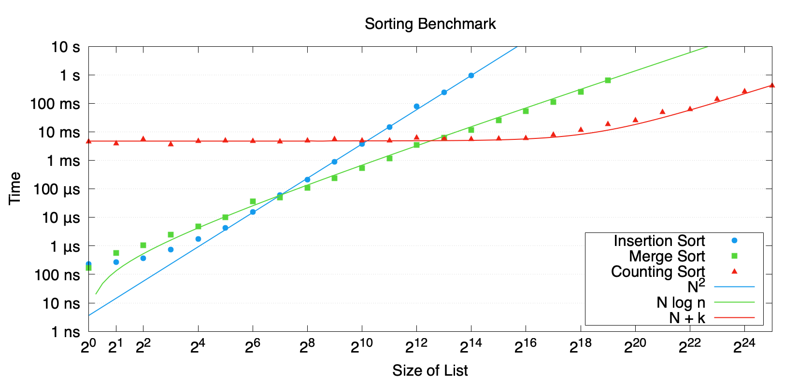

# lean-sorting

A small Lean 4 project for implementing sorting algorithms and proving that
they satisfy a simple sorting contract.

The project currently includes insertion sort and recursive merge sort over a
generic decidable total order, counting sort for natural numbers, plus a small
CLI for trying the natural-number sorters from stdin.



## Build

This project is managed by Lake and pinned to the Lean version in
`lean-toolchain`.

```sh
lake build
```

## Run

The executable is `lean-sorting` and uses subcommands.

```sh
printf '5 3 1 4 2\n' | lake exe lean-sorting insertion-sort
printf '5 3 1 4 2\n' | lake exe lean-sorting merge-sort
printf '5 3 1 4 2\n' | lake exe lean-sorting counting-sort
lake exe lean-sorting generate-numbers 10 100
lake exe lean-sorting benchmark
```

## Benchmark Graph

The benchmark emits CSV. To regenerate `benchmark.png` without Numbers, install
`gnuplot` and run:

```sh
lake exe lean-sorting benchmark > benchmark.csv
gnuplot scripts/benchmark.gnuplot
```

## Layout

- `LeanSorting/Sorting.lean` defines the sorting contract.
- `LeanSorting/InsertionSort.lean` implements and proves insertion sort.
- `LeanSorting/RecursiveMergeSort.lean` implements and proves merge sort.
- `LeanSorting/CountingSort.lean` implements counting sort.
- `LeanSorting/App.lean` is the CLI entrypoint.
